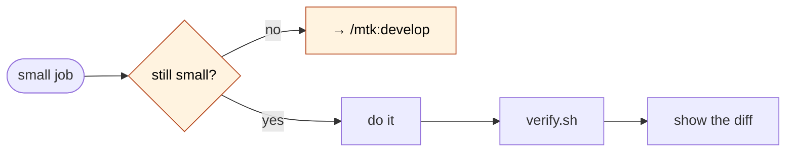

# chore

Small job. Do it, check it, show it. No phases, no gates.



## The entry test — run it first, in one line

A chore is **both** of these:

1. You already know **how** to do it — no research needed
2. It's **small** — one or two files, and you can describe the whole change in a sentence

If either is false, **stop and say so**: *"This isn't a chore because X. Use `/mtk:develop`."*
Then stop. Do not start it anyway.

## Do the work

1. Make the change.
2. Run the checks:
   ```bash
   "${CLAUDE_SKILL_DIR}/../../scripts/verify.sh"
   ```
3. Show `git diff --stat` and say what you changed in one line.

That's the whole skill.

## The escape hatch — the important part

**If it grows while you are in it, stop.** Any of these means it stopped being a chore:

| Signal | What to do |
|---|---|
| you're touching a **third** file | stop, report, offer `/mtk:develop` |
| you had to **read around** to understand something | stop — you didn't know how after all |
| something **broke** that you didn't expect | stop — that's a bug, not a chore |
| you're about to **guess** at intent | stop and ask |

Say what you did so far and what stopped you. Do not push through — a chore that grew is exactly the thing the full pipeline exists for, and finishing it here means it got no plan and no gate.

## Boundaries

- **Never commit.** Make the change, show the diff, leave it. Committing is the user's move.
- **Never merge, branch, or push.**
- **No worktree.** Chores are small and the user is watching. If it needs isolation, it isn't a chore.
- **If `verify.sh` reports failures you did not cause**, say so plainly and leave them. Fixing what you found is a different job.

## Red flags

| If you catch yourself thinking… | Do this instead |
|---|---|
| "It's grown a bit but I'm nearly done" | Stop. Nearly done is where unplanned work ships. |
| "I'll just also fix this while I'm here" | No. That's a second chore. Mention it, don't do it. |
| "The checks were already failing, close enough" | Report which failures are yours and which were there before. |
| "This is borderline, chore is faster" | Borderline goes to `/mtk:develop`. Two minutes of questions beats an afternoon. |
