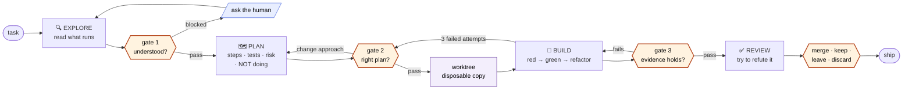

# development-pipeline

Four phases. Three gates. The gates are the product — the phases are just where work happens.



Every arrow leaving a gate is a decision a human made. There is no path from task to
ship that skips one.

> **This skill does not run forked.** It must be able to call `AskUserQuestion`.
> If it cannot, every gate is BLOCKED — see `mtk:quality-gates`. A pipeline that
> cannot ask is a pipeline that will claim it asked.

## Rules that hold across all four phases

0. **BUILD happens in a worktree, never in the user's folder.** See Phase 3 step 0.
1. **Never skip forward.** No writing code during EXPLORE, no exploring during BUILD. If you find yourself needing to, that is a signal the previous gate was passed too early — go back through it.
2. **Every gate emits the block from `mtk:quality-gates`, then calls `AskUserQuestion`, then waits.** No exceptions, no "this one is obvious".
3. **State assumptions out loud, always.** An assumption nobody heard is a decision you made on the user's behalf without telling them.
4. **Evidence, not confidence.** "Tests pass" is a claim. Command output is evidence.

---

## Phase 1 — 🔍 EXPLORE

**Goal:** understand the real situation before having any opinion about it.

Do:
- Read the code that actually runs. Follow the imports.
- Find how this thing is done *elsewhere in this repo* — match the house style, don't import your own.
- Look for the existing tests. They document intent better than comments.
- Note what's missing: no tests, no types, a TODO from two years ago.

Do **not**: propose a solution, edit a file, or start a branch.

**Output:** what exists, how it works now, what surprised you.

### Gate 1 — is this understood?

Score the task 1–5 (`mtk:quality-gates`). Then report:

- what you found
- **what you could not find**, and whether it blocks you
- assumptions you'd otherwise make silently
- the questions where two reasonable answers lead to different code

Then ask.

---

## Phase 2 — 🗺️ PLAN

**Goal:** decide what will be done, in what order, and how you'll know it worked.

Produce:

| | |
|---|---|
| **Steps** | ordered, each one independently checkable |
| **Files** | which get touched, and roughly how |
| **Tests** | what proves each step works, written before the step |
| **Risk** | what could break elsewhere, and how you'd notice |
| **Not doing** | scope you are deliberately leaving out |

That last row matters most. A plan without an explicit *not doing* list is how a two-file change becomes a twelve-file change.

If the task scored 4–5, break it into subtasks and plan only the first one. Planning three days of work in advance is fiction.

### Gate 2 — is this the right plan?

Present the plan and ask. Offer the real options: proceed / change the approach / cut scope / stop.

---

## Phase 3 — 🔨 BUILD

**Goal:** make the plan real, one checkable piece at a time.

### Step 0 — get a worktree before touching a single file

```bash
WT=$("${CLAUDE_SKILL_DIR}/../../scripts/worktree.sh" new <slug>)
cd "$WT"
```

Everything in this phase happens in `$WT`. The user's working folder is not yours
to edit. Say the path out loud once, so they know where the work is.

- Pick a `<slug>` from the task — `fix-lint`, `add-export`. Short, lowercase.
- **If the repo is not a git repo**, the script exits 2. Do not fall back to editing
  in place — stop, say so, and ask.
- **If the task is a single trivial edit** the user asked for directly in their own
  folder, ask before making a worktree. Isolation is for work you are running, not
  for a one-line change they are watching.

For each step in the plan:

1. **Write the failing test first.** Run it. Watch it fail. A test that has never failed proves nothing.
2. Write the smallest code that passes it.
3. Run the test. Watch it pass.
4. Refactor only while green.

Rules:
- **Stay inside the plan.** Something you notice mid-build that isn't in the plan goes on a list; it does not go into this commit.
- **Three failed attempts at the same step = STOP.** That's a blocking condition, not a reason to try harder. Go back to gate 2.
- If the code has no test setup at all, say so at gate 2 — don't silently build a test harness nobody asked for.

**Output:** working code, plus the red-then-green output for each step.

### Gate 3 — does the evidence hold?

Run `mtk:verify` **inside the worktree** (`--dir "$WT"`). Present:

- the real check output (blocking vs noise, per that skill)
- the diff: `scripts/worktree.sh diff <slug>`
- which plan steps are done, which are not
- anything you put on the "noticed but didn't do" list

Then ask, and offer these four — they are the real options, not a formality:

| Choice | What happens |
|---|---|
| **merge** | `git merge mtk/<slug>` into their branch, then `worktree.sh drop <slug> --purge` |
| **keep for later** | `worktree.sh drop <slug>` — folder gone, branch and commits stay |
| **leave it open** | change nothing; they will look at `$WT` themselves |
| **throw it away** | `worktree.sh drop <slug> --purge` — folder and branch both gone |

**Never merge without being told to**, and never purge a branch the user has not
seen the diff of. Deleting a folder is cheap; deleting the only copy of the work
is not — those are different actions and the flags that do them are different
on purpose.

---

## Phase 4 — ✅ REVIEW

**Goal:** try to prove the work is wrong before someone else does.

- Re-read the diff as if you didn't write it.
- Check it against the plan — did scope creep in?
- Check the edges the tests don't cover: empty input, failure of the thing you called, concurrent use.
- Ask the hostile question: *"if this is broken in production next week, what was it?"*

Answer that question honestly, in one sentence, before declaring done.

**Output:** the diff, the evidence, the one honest risk sentence.

---

## The dial — where you stay in the loop

Every gate has three settings. Start all three at **ask**, and turn one down only after it has earned it.

| Setting | Behaviour | Use when |
|---|---|---|
| **ask** | stops, asks, waits | default. always start here. |
| **announce** | states its finding and continues after a beat | the gate has been right ~10 times running |
| **silent** | logs and continues | never for gate 2. |

Turning a gate down is a decision you make on purpose, in this file, after evidence — not something the pipeline does for you because asking was inconvenient. That is the whole difference between *taking yourself out of the loop* and *being quietly cut out of it*.

**Current settings:**

| Gate | Setting |
|---|---|
| g1 — understood? | ask |
| g2 — right plan? | ask |
| g3 — evidence holds? | ask |

## Red flags

| If you catch yourself thinking… | Do this instead |
|---|---|
| "I already know this codebase, skip EXPLORE" | You know what it was. Read what it is. |
| "The plan is obvious, I'll just build" | Then writing it down costs 60 seconds. Write it down. |
| "I'll write the test after, it's faster" | A test written after the code tests the code you wrote, not the behaviour you wanted. |
| "This gate would just annoy them" | They set it to `ask`. Honour it or ask them to change it. |
| "Close enough to done" | Phase 4 exists for exactly this thought. Answer the hostile question. |
