# development-pipeline

Six phases. Five gates, then one final decision. The gates are the product — the phases are just where work happens.

```mermaid
flowchart LR
  START([task]) --> E["🔍 EXPLORE<br/>read what runs"]
  E --> G1{{"gate 1<br/>understood?<br/>which mode?"}}
  G1 -->|blocked| ASK1[/"ask the human"/]
  ASK1 --> E
  G1 -->|pass| D["🧭 DESIGN<br/>spread · narrow<br/>· choose"]
  G1 -->|bugfix mode| P
  D --> G2{{"gate 2<br/>right approach?"}}
  G2 -->|look again| D
  G2 -->|pass| H["🎯 HYPOTHESIZE<br/>the bet · what<br/>kills it · done means"]
  H --> G3{{"gate 3<br/>right bet?"}}
  G3 -->|bet is weak| D
  G3 -->|pass| P["🗺️ PLAN<br/>steps · tests · risk<br/>· NOT doing"]
  P --> G4{{"gate 4<br/>right plan?"}}
  G4 -->|change approach| P
  G4 -->|pass| WT["worktree<br/>disposable copy"]
  WT --> B["🔨 BUILD<br/>red → green → refactor"]
  B -->|3 failed attempts| G4
  B --> G5{{"gate 5<br/>evidence holds?"}}
  G5 -->|fails| B
  G5 -->|pass| R["✅ REVIEW<br/>try to refute it"]
  R --> CH{{"merge · keep ·<br/>leave · discard"}}
  CH --> DONE([ship])

  classDef gate fill:#fff3e0,stroke:#B5451B,stroke-width:2px,color:#000
  classDef human fill:#e8eeff,stroke:#3B5BDB,color:#000
  class G1,G2,G3,G4,G5,CH gate
  class ASK1 human
  classDef box fill:#f3eefc,stroke:#6B3FA0,color:#000
  class WT box
```



Every arrow leaving a gate is a decision a human made. There is no path from task to
ship that skips one.

> **This skill does not run forked.** It must be able to call `AskUserQuestion`.
> If it cannot, every gate is BLOCKED — see `mtk:quality-gates`. A pipeline that
> cannot ask is a pipeline that will claim it asked.

## Modes — the task decides how much of the pipeline runs

Pick the mode from the task. An explicit first word in the arguments wins.

| Mode | The task is… |
|---|---|
| `greenfield` | new code; nothing that exists has to change |
| `brownfield` | a change to code that already runs |
| `bugfix` | something is broken — "bug", "fix", "error", "regression" |
| `refactor` | the same behaviour in a different structure |

**The mode is an assumption until gate 1.** State it there and let the human change it.

| Phase | greenfield | brownfield | bugfix | refactor |
|---|---|---|---|---|
| EXPLORE looks for | house patterns to copy; where it will live | blast radius; the existing tests | a reliable repro; the cause, not the symptom | every caller; how well tests cover it |
| DESIGN | full | two approaches | **skipped** | the target shape only |
| HYPOTHESIZE | full | what this change could break | **skipped** | what proves behaviour did not change |
| PLAN | full | full | short: cause, fix, regression test | full |
| BUILD — first test | new behaviour, failing | changed behaviour, failing | reproduces the bug, failing | characterization tests, passing |
| REVIEW asks | does it do what *Done means* says? | did anything that worked stop working? | is the cause fixed, or only this symptom? | is behaviour identical? |

A phase is skipped because a human confirmed the mode at gate 1 — never because it
looked unnecessary. Its gate is skipped with it, and the other gates keep their numbers.

**If a bugfix has two reasonable fixes that lead to different code, it is not a bugfix.**
Say so and go back to gate 1 for a different mode.

## Logging — one line at each boundary

At the very start of a run, name it once:

```bash
export MTK_RUN="<slug>-$(date +%H%M%S)"
```

Then emit an event at each boundary. `scripts/event.sh` never fails and never
blocks for more than 2 seconds, so a missing or stopped server costs nothing:

```bash
S="${CLAUDE_SKILL_DIR}/../../scripts/event.sh"
"$S" phase_start phase=EXPLORE mode=brownfield
"$S" gate_ask   gate=1 question="..."      # right before you call AskUserQuestion
"$S" gate_answer gate=1 answer="..."       # right after they reply
"$S" phase_end  phase=EXPLORE
"$S" agent_start agent=tdd-implementer     # before dispatching one
"$S" run_end    outcome=merged
```

Phase names are `EXPLORE`, `DESIGN`, `HYPOTHESIZE`, `PLAN`, `BUILD`, `REVIEW`.
`verify.sh` and `worktree.sh` log themselves — do not log for them.

This is the only part of the pipeline that depends on you remembering. A skipped
event costs nothing except a gap in the record, so never let logging interrupt
the work or become a reason to pause.

## Rules that hold across all six phases

0. **BUILD happens in a worktree, never in the user's folder.** See Phase 5 step 0.
1. **Never skip forward.** No designing during EXPLORE, no writing code before BUILD, no exploring during BUILD. If you find yourself needing to, that is a signal the previous gate was passed too early — go back through it.
2. **Every gate emits the block from `mtk:quality-gates`, then calls `AskUserQuestion`, then waits.** No exceptions, no "this one is obvious".
3. **State assumptions out loud, always.** An assumption nobody heard is a decision you made on the user's behalf without telling them.
4. **Evidence, not confidence.** "Tests pass" is a claim. Command output is evidence.

---

## Phase 1 — 🔍 EXPLORE

**Goal:** understand the real situation before having any opinion about it.

**If the argument is a path to a `specs/*.md` file, read it first.** It already
carries the problem, what done means, the chosen approach, what is deliberately out
of scope, and the open questions. Explore the code against that, and raise anything
the spec got wrong at gate 1 rather than quietly working around it. Its **Not doing**
list is binding — treat it as scope the user already refused.

Do:
- Read the code that actually runs. Follow the imports.
- Find how this thing is done *elsewhere in this repo* — match the house style, don't import your own.
- Look for the existing tests. They document intent better than comments.
- Note what's missing: no tests, no types, a TODO from two years ago.
- Look for what the mode names in the table above.

Do **not**: propose a solution, edit a file, or start a branch.

**Output:** what exists, how it works now, what surprised you.

### Gate 1 — is this understood?

Score the task 1–5 (`mtk:quality-gates`). Then report:

- what you found
- **the mode you assumed**, and which phases it skips
- **what you could not find**, and whether it blocks you
- assumptions you'd otherwise make silently
- the questions where two reasonable answers lead to different code

Then ask.

---

## Phase 2 — 🧭 DESIGN

**Goal:** choose an approach on purpose, before a plan turns the first idea into the only idea.

**If the task came with a `specs/*.md` that has an Approach**, design already
happened. Do not redo it. Check that approach against what EXPLORE found, and take
anything that no longer holds to gate 2.

Otherwise use the method in `mtk:spec` Phases 2 and 3: spread, then narrow to two,
with *how it works · cost · breaks when · test* for each. Scale it by mode — the
table above says how much.

Do **not**: write steps, list files to touch, or edit anything. That is PLAN.

**Output:** two approaches, the one you recommend, and why the other one lost.

### Gate 2 — is this the right approach?

Present both and ask. Offer the real options: the recommended one / the other one /
neither, look again / stop.

---

## Phase 3 — 🎯 HYPOTHESIZE

**Goal:** say what you are betting on, and what would show the bet is wrong, while being wrong is still cheap.

Produce four things, each short:

| | |
|---|---|
| **The bet** | the one assumption the chosen approach depends on. If it is false, the approach is wrong. |
| **Kills it** | up to three things that would prove the bet false |
| **Done means** | checkable lines, each either true or false. "Fast" is not one. "Under 300ms at 100 requests/second" is. |
| **Cheapest proof** | the smallest thing that tests the bet before the full build — often the first failing test, sometimes a short spike |

A bet you cannot think of a way to lose is not a bet. You have not found the
assumption yet — say that instead of inventing a risk.

When a spec file already has **Done means** and **Breaks when**, use them. Do not rewrite them.

A spike is code, so it does not run here. It becomes step 1 of the plan and runs in the worktree.

**Output:** the four rows.

### Gate 3 — is this the right bet?

Present the four rows and ask. Offer: proceed to plan / the bet is weak, back to
design / change what done means / stop.

---

## Phase 4 — 🗺️ PLAN

**Goal:** decide what will be done, in what order, and how you'll know it worked.

Produce:

| | |
|---|---|
| **Steps** | ordered, each one independently checkable. The cheapest proof from gate 3 goes first. |
| **Files** | which get touched, and roughly how |
| **Tests** | what proves each step works, written before the step. Every *Done means* line is covered by at least one. |
| **Risk** | what could break elsewhere, and how you'd notice |
| **Not doing** | scope you are deliberately leaving out |

That last row matters most. A plan without an explicit *not doing* list is how a two-file change becomes a twelve-file change.

If the task scored 4–5, break it into subtasks and plan only the first one. Planning three days of work in advance is fiction.

### Gate 4 — is this the right plan?

Present the plan and ask. Offer the real options: proceed / change the approach / cut scope / stop.

---

## Phase 5 — 🔨 BUILD

**Goal:** make the plan real, one checkable piece at a time.

### Step 0 — get a worktree before touching a single file

```bash
WT=$("${CLAUDE_SKILL_DIR}/../../scripts/worktree.sh" new <slug>)
cd "$WT"
```

Everything in this phase happens in `$WT`. The user's working folder is not yours
to edit. Say the path out loud once, so they know where the work is.

- Pick a `<slug>` from the task — `fix-lint`, `add-export`. Short, lowercase.
- **If the repo is not a git repo**, the script exits 2. Do not fall back to editing
  in place — stop, say so, and ask.
- **If the task is a single trivial edit** the user asked for directly in their own
  folder, ask before making a worktree. Isolation is for work you are running, not
  for a one-line change they are watching.

For each step in the plan:

1. **Write the failing test first.** Run it. Watch it fail. A test that has never failed proves nothing.
2. Write the smallest code that passes it.
3. Run the test. Watch it pass.
4. Refactor only while green.

**In `refactor` mode the first tests pass on purpose** — they record what the code
does today. A test that has never failed still proves nothing, so break the code
once, watch the characterization test fail, and restore it. Then refactor in small
steps and stay green.

Rules:
- **Stay inside the plan.** Something you notice mid-build that isn't in the plan goes on a list; it does not go into this commit.
- **Three failed attempts at the same step = STOP.** That's a blocking condition, not a reason
  to try harder. Go back to gate 4. This is **enforced**: a `PreToolUse` hook denies a Bash
  command that has already failed three times with the same result. When you see that denial,
  report what you tried and hand it back — do not reword the command to get past it.
- **If a "Kills it" from gate 3 shows up, stop.** The bet is lost. Go back to gate 2 — do not patch around it.
- If the code has no test setup at all, say so at gate 4 — don't silently build a test harness nobody asked for.

**Output:** working code, plus the red-then-green output for each step.

### Gate 5 — does the evidence hold?

Run `mtk:verify` **inside the worktree** (`--dir "$WT"`). Present:

- the real check output (blocking vs noise, per that skill)
- the diff: `scripts/worktree.sh diff <slug>`
- which plan steps are done, which are not
- anything you put on the "noticed but didn't do" list

Then ask whether the evidence holds, and offer these three:

| Choice | What happens |
|---|---|
| **continue to review** | the evidence holds — move to Phase 6 |
| **back to build** | a check failed or a plan step is missing — fix it in `$WT`, then run gate 5 again |
| **stop** | leave the worktree as it is; nothing is merged or deleted |

**This gate does not decide what happens to the work.** Merge, keep and discard are
offered only after Phase 6, because a review that runs after the merge can no longer
stop anything.

---

## Phase 6 — ✅ REVIEW

**Goal:** try to prove the work is wrong before someone else does.

- Re-read the diff as if you didn't write it.
- Check it against the plan — did scope creep in?
- Mark every *Done means* line true or false, with the evidence for each. A line you cannot mark is false.
- Answer the question the mode asks in the table above.
- Check the edges the tests don't cover: empty input, failure of the thing you called, concurrent use.
- Ask the hostile question: *"if this is broken in production next week, what was it?"*

Answer that question honestly, in one sentence, before declaring done.

**Output:** the diff, the evidence, the *Done means* list marked, the one honest risk sentence.

### Final decision — what happens to the work?

Present the risk sentence together with the diff, then ask, and offer these four —
they are the real options, not a formality:

| Choice | What happens |
|---|---|
| **merge** | `git merge mtk/<slug>` into their branch, then `worktree.sh drop <slug> --purge` |
| **keep for later** | `worktree.sh drop <slug>` — folder gone, branch and commits stay |
| **leave it open** | change nothing; they will look at `$WT` themselves |
| **throw it away** | `worktree.sh drop <slug> --purge` — folder and branch both gone |

**Never merge without being told to**, and never purge a branch the user has not
seen the diff of. Deleting a folder is cheap; deleting the only copy of the work
is not — those are different actions and the flags that do them are different
on purpose.

---

## The dial — where you stay in the loop

Every gate has three settings. Start all five at **ask**, and turn one down only after it has earned it.

| Setting | Behaviour | Use when |
|---|---|---|
| **ask** | stops, asks, waits | default. always start here. |
| **announce** | states its finding and continues after a beat | the gate has been right ~10 times running |
| **silent** | logs and continues | never for gate 4. |

Turning a gate down is a decision you make on purpose, in this file, after evidence — not something the pipeline does for you because asking was inconvenient. That is the whole difference between *taking yourself out of the loop* and *being quietly cut out of it*.

**Current settings:**

| Gate | Setting |
|---|---|
| g1 — understood? | ask |
| g2 — right approach? | ask |
| g3 — right bet? | ask |
| g4 — right plan? | ask |
| g5 — evidence holds? | ask |

## Red flags

| If you catch yourself thinking… | Do this instead |
|---|---|
| "I already know this codebase, skip EXPLORE" | You know what it was. Read what it is. |
| "The design is obvious, skip DESIGN" | Then gate 2 takes one minute. A design with no rejected option is a first idea. |
| "This is basically a bugfix, that skips two phases" | The mode is confirmed by a human at gate 1. It is not picked for speed. |
| "Nothing could prove this wrong" | Then you have not found the bet. Keep looking, or say you cannot find it. |
| "The plan is obvious, I'll just build" | Then writing it down costs 60 seconds. Write it down. |
| "I'll write the test after, it's faster" | A test written after the code tests the code you wrote, not the behaviour you wanted. |
| "This gate would just annoy them" | They set it to `ask`. Honour it or ask them to change it. |
| "Close enough to done" | Phase 6 exists for exactly this thought. Answer the hostile question. |
