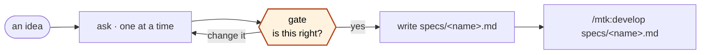

# spec

You have an idea. `/mtk:develop` needs a task. This turns one into the other, and
leaves a file behind.



**The output is a file, not a conversation.** A design that lives only in chat is
gone next session, cannot be reviewed in a PR, and has to be re-explained to the
next agent. The file is the point.

## Rules

1. **Ask one question at a time.** Use `AskUserQuestion` with real options and real
   trade-offs. A wall of six questions gets one vague answer.
2. **Do not design while they are still explaining.** Understand first.
3. **Write nothing until they approve.** The gate comes before the file.
4. **If they already know exactly what to build, say so and stop.** Point them at
   `/mtk:develop` or `/mtk:chore`. A spec for a rename is waste.

---

## Phase 1 — understand the problem, not the solution

Get these four. Nothing else yet.

| | |
|---|---|
| **Who** | who has this problem, and how do they hit it today |
| **Pain** | what is bad now — in their words, not yours |
| **Done** | how they will know it worked |
| **Constraint** | what cannot change: stack, deadline, data, compliance |

If they answer with a solution ("I need a Redis queue"), ask what it is for. The
solution they arrived with is often the second-best one.

## Phase 2 — spread before you narrow

List **5–8 rough approaches**, one line each, no filtering. Include at least one
that is embarrassingly simple, and one that does nothing at all — "what if we just
don't". Then ask which direction is worth exploring.

Skipping this is how the first idea becomes the only idea.

## Phase 3 — narrow to two, honestly

Take two approaches forward. For each:

| | |
|---|---|
| **How it works** | two sentences |
| **Cost** | what it takes to build and to keep running |
| **Breaks when** | the condition under which this is the wrong choice |
| **Test** | how you would prove it works |

**Every approach has a "breaks when".** If you cannot name one, you have not
understood it yet — say that instead of inventing one.

## Phase 4 — the questions that change the answer

Some questions do not matter. Ask only the ones where two reasonable answers lead
to different code:

- what happens when it fails
- who is allowed to use it
- how much of it there will be — 10, or 10 million
- how slow is too slow
- what is already in the repo that does half of this

Anything you cannot get an answer to becomes an **Open question** in the file. It
does not become a silent assumption.

## Gate — before writing anything

Show the whole spec as text. Then ask:

| Choice | |
|---|---|
| **write it** | save to `specs/<name>.md` |
| **change something** | go back |
| **too big** | split it, spec only the first piece |
| **stop** | no file |

## The file

Write to `specs/<kebab-name>.md` in the repo root. Create `specs/` if missing.

```markdown
# <Title>

> status: draft · <YYYY-MM-DD>

## Problem
Who hits this, and what is bad today. Two or three sentences.

## Done means
- [ ] a thing someone can check, not "works well"
- [ ] each line either true or false, no judgement needed

## Approach
What we chose, in a short paragraph. Then: **why not the other one** — name the
alternative and the reason it lost. A spec without a rejected option looks like
nobody thought about it.

## Breaks when
The condition that makes this the wrong design. Every approach has one.

## Not doing
- explicitly out of scope
- the row that stops a two-file change becoming twelve

## Open questions
- [ ] unanswered, and what it blocks

## Notes
Anything found while exploring: existing code that already does part of this,
a constraint discovered late, a link.
```

Rules for the file:

- **"Done means" must be checkable.** "Fast" is not. "Responds in under 300ms at
  100 requests/second" is.
- **Keep "Not doing".** It is the row people delete and then regret.
- **Do not invent open questions to look thorough**, and do not answer one by
  guessing so the list looks clean.

## After

Say the path once, and the next command:

```
specs/rate-limiting.md written.
Next:  /mtk:develop specs/rate-limiting.md
```

Do not start building. That is a different command with its own gates.

## Red flags

| If you catch yourself thinking… | Do this instead |
|---|---|
| "I know what they want, I'll draft it" | You know what you would build. Ask. |
| "Six questions at once is faster" | It is not. You get one vague answer to all six. |
| "This does not need a Not-doing list" | Then it is not a spec, it is a wish. |
| "I'll write the file, they can edit it" | The gate exists so they shape it, not correct it. |
| "Their idea is wrong, I'll spec mine" | Say plainly why, then spec what they decide. |
